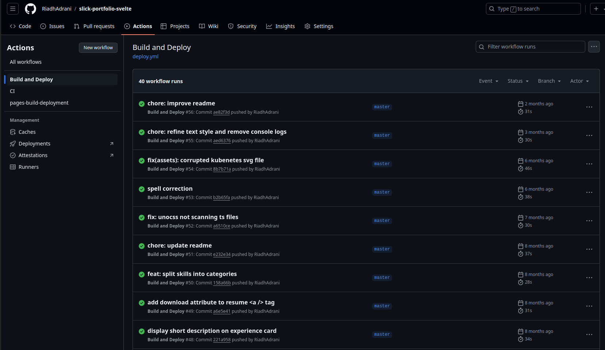
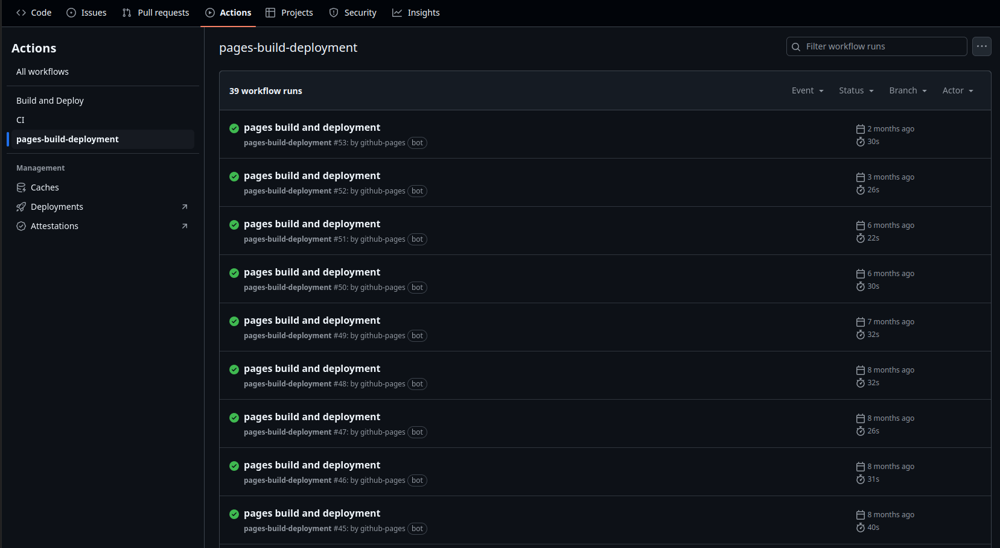

# My Portfolio With Svelte.

Originally forked from [RiadhAdrani](https://github.com/RiadhAdrani/slick-portfolio-svelte-5) and then modified by me. 


## Deploy to GitHub pages

Before deploying to `GitHub Pages`:

### Enable workflows for `Forks`

If you forked the repo, go to the `Actions` tab in the newly generated repository, and enable workflows, click on the green button `I understand my workflows, go ahead and enable them` :


### Actions Settings

Allow `GitHub Pages` in your repo settings with correct permissions:

- go to your repo `Settings` > `Actions` > `General`
- in `Actions permissions` : make sure that `Allow all actions and reusable workflows` checkbox is checked


### svelte.config.js

Depending on the name of your repository, you would like to set the `base` variable to that, starting with a leading slash like this:

```js
const base = '/slick-portfolio-svelte';
```

But if your repository name is the same as your Github domain name; my Github name is `RiadhAdrani` so my domain name is `riadhadrani.github.io` (lower cased), and so the special repository name is also `riadhadrani.github.io`: if that is the case, you need to set the base to an empty string

```js
const base = '';
```

### Launching the build and deploy workflow

If you didn't commit and push the changes in the `svelte.config.js` yet, you can do that now, otherwise you can create an empty commit:

```bash
git commit --allow-empty -m "chore: trigger workflow"
```

and push it to your `master` or `main` branch.

In the `Actions` tab, make sure that the `Build and Deploy` workflow is successful (wait for it to complete): you should have at least one successfull workflow run:



### Enable GitHub pages

- go to your repo's `Settings` > `Pages`
- in Source section, select `Deploy from a branch`.
- in Branch section, select `gh-pages` and `/ (root)` and click on save


Again in the `Actions` tab, make sure that the `pages-build-deployment` workflow is successful (wait for it to complete): you should have at least one successfull workflow run:



> If for some reason no action was launched, try pushing empty commit.
